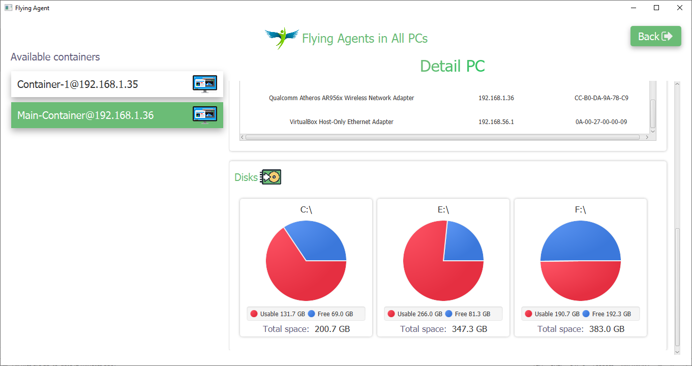
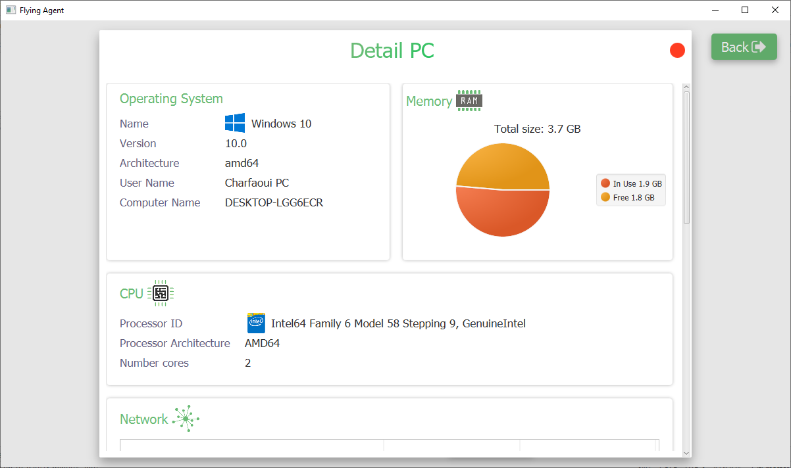

 # Flying Agent 💻 🤖 🚀

### Problem Statement 🔧
Say that we have a mobile agent that moves on a platform distributed on 3 machines having each a container. The role of the agent is to recover the mac address of each machine during his displacement.

### What we doing 🔌
Alongside recovering mac address of each machine, we develop a desktop application that use agents to get all the models.information about the PC's neighboring it, like CPU, operating system and basics models.information.

### Requirments ✅
We use extensively the Jade Platform which allows us to create agents, make platforms, and run them on different machines and various platform, here is a link to the official jade [website](http://jade.tilab.com/).

### Screenshots
| Select type of scan |
|:-------------:|
|  |
| Scan each PC (Available Containers) |
|  |
| Scan all PCs |
|  |
| Scan all PCs (Disks details) |
|  |
| Details of selected PC |
|  |
| More details of selected PC |
|  |

### Used Technology
* JavaFX.

### Used Libraries
* Jade.
* JFoenix (Material Design).
* FontAwesomeFX (Icons).
* Json (Data type that is sent in the network).
* Gson (Parse Json from/to Java Object).

### Contributing 💡
If you want to contribute to one of this projects and make it better with new ideas or fixing issues, your pull request is very welcomed.
If you find any issue just put it in the repository issue section, thank you.
